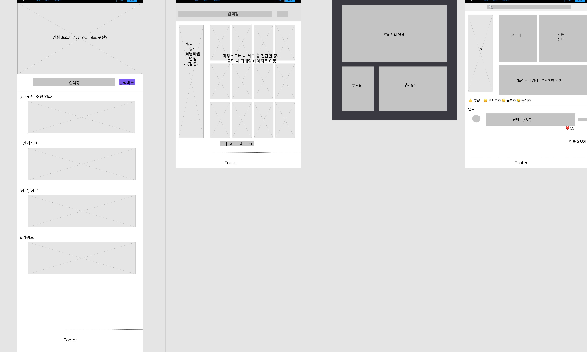
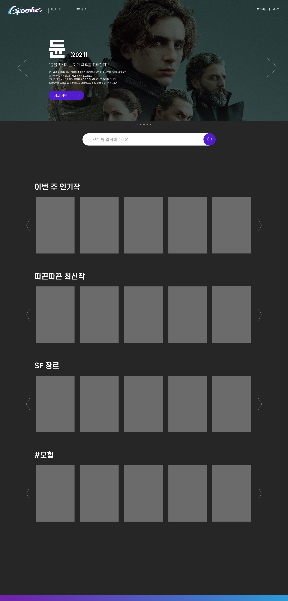
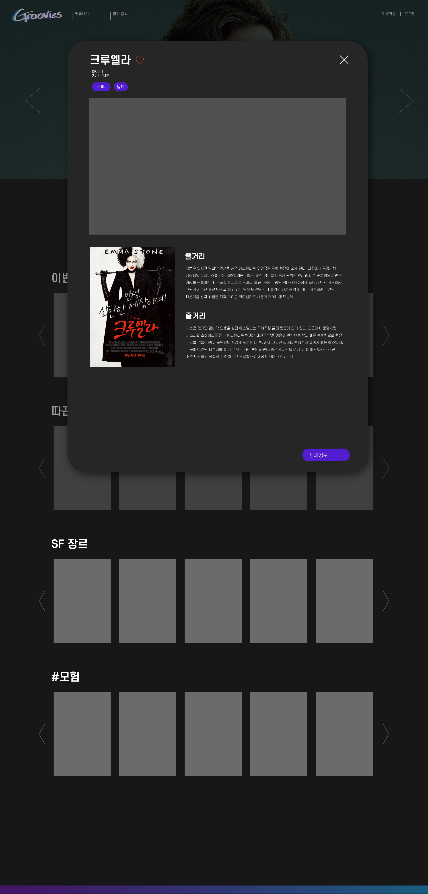

## FINAL PJT

1st day (2021-11-17)

### 오늘 한 일

* 팀명, 구호, 팀장 선정

* 서비스명, 컨셉 정하기
* 기술스택 선정
* API 선정
* 구현 기능, 화면 배치 정하기 (진행중)
* UI/UX 프로토타입 제작

 

### 사용한 협업 툴

* 피그마(UI/UX)
* Adobe Illustrator (UI)
* Notion (과정 기록 및 공유)

 

### 결과물

토론하면서 피그마로 실시간으로 함께 만든 와이어프레임

 

정리된 와이어프레임을 바탕으로 혼자 만들어 본 예상 화면 (진행중)

 

### 소감

오늘은 시작하는 단계이기 때문에, 기획자스러운 일과 디자이너스러운 일 위주로 했다.

기획이 가장 어려운 것 같다. 웹사이트의 컨셉을 명확하게 정해야 구현할 화면 이야기를 나눌 수 있다는 이야기를 전달하는 것부터 오래걸렸고, 자잘한 소통의 오류가 많이 있었던 것 같다. 둘 다 협업을 안해본 영역이라 협업툴을 찾는 것부터 시작이었고, 원하는 바를 정확한 용어로 표현을 못해서 더 헤매는 것 같은 느낌이 있었다. 그리고 하고 싶은 기능들 + 주어진 짧은 시간 내에 우리가 지금까지 배운 실력으로 구현을 해낼 수 있을 것인지에 대한 고려까지 해야 해서 사이트의 구조를 정하는 것이 어려웠다. 

일단 정리된 바로는, 이 사이트에 들어오는 목적은 

1. 마음에 들만한 영화를 추천받고 둘러보기 위해서 
2. 영화에 대한 이야기를 나누기 위해서

이므로, 한 가지 영화에 대해 깊이 파고들어 알기보다는 이 영화 저 영화를 간편하게 탐색하고 다니는 것이 영화 탭의 목적이라고 생각했다.  그래서 어떤 영화의 상세정보를 보고 싶을 때 처음부터 페이지를 아예 이동해버리기보다는 모달 창으로 트레일러 영상을 포함한 간단한 정보들을 띄워준 다음에 흥미가 없다면 쉽게 모달 창을 끄고 다른 영화를 구경하고, 더 흥미가 생긴다면 영화 상세 페이지로 넘어갈 수 있는 구조로 설정했다. 

내일부터 개발 단계로 들어갈텐데, 사실 아직도 좀 막막하다. 백엔드가 없는 상황에서 어떻게 프론트 구현을 시작해야 할지도 잘 모르겠고, 뷰를 배운게 채 2주가 되지 않아서 뷰에 제대로 css 붙여본 적도 없고.. API에서 데이터 긁어오는 것조차 해본적이 없으니까,, 모든게 다 낯설다😥 그래도 일단 페어와 구글 선생님께 질문을 열심히 해가면서 퀄리티 있는 사이트가 완성됐으면 좋겠다. 내 욕심이 과욕으로 끝나지 않기를..ㅠ

+

#### 기록하지 못했던 이전 이야기

최종 플젝 팀을 정할 때 얼마만큼의 성과를 바라는지가 비슷한 사람들과 팀을 하는게 좋다는 교수님의 의견에 따라 의견조사를 했는데.. 우리 반에서 나만! 수상을! 원한다고! 해버렸고! (원래 몇 명 더 있었던 것 같은데 금방 탈주한 것 같다.. why...?😥) 교수님은 나에게 잘하시는 분들이라며 두 명을 추천해줬고.. 그래서 그나마 관통플젝때 한번 만난 적 있었던 민채님에게 연락을 해서 팀을 짜게 됐다..ㅋ 하.. 왜 나만??? 이렇게 된 이상 내가 진짜로 잘해서 수상을 해야 우습지 않아질 것 같아서 더 부담스럽다ㅠㅠㅠㅠ 이렇게까지 부담스러워질 생각은 없었는데.. 그냥 이왕 하는거 좀 잘해서 포폴로 남기고 싶은 것 뿐이었는데.. ㅜㅜ 아무튼.. 그렇게 됐다.. 

 

