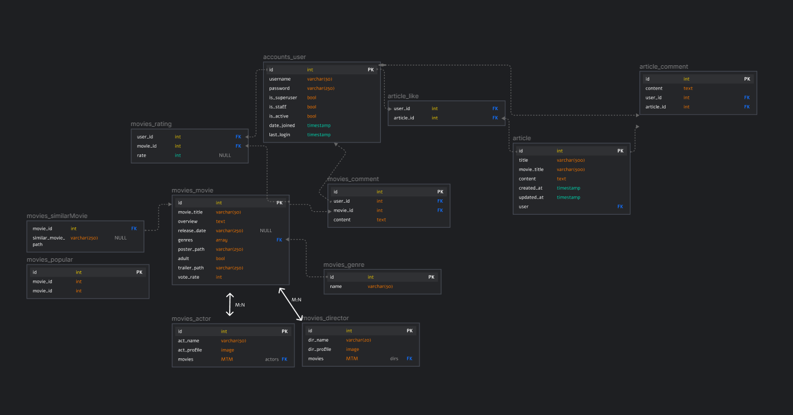

## FINAL PJT

2nd day (2021-11-18)

### 오늘 한 일

* UI 프로토타입 끝내기
* 추천 알고리즘 정하기
* ERD 그리기
* DB 수집
* 기본 기능 구현
  * 기본 구조, 스타일 작성

<br>

### 결과물 및 설명

#### ERD (제작중..)



복잡하고 깔끔하지가 않다ㅠ figma 사용법이 익숙하지 못해서 글자 색깔 바꾸는것도 모르고ㅠ 화살표는 왜 꺾인모양 밖에 안되는 것이오..ㅠ 당연히 하는 방법이 있겠지만 관계모델 짜는 것만해도 머리가 아파서 대충 그렸다(...) tmdb의 API 데이터를 긁어다가 db를 만들어야 하는 건데 나랑 페어 둘다 해본 적이 없어서 (해본 것보다 안해본 게 많은ㅋㅋ) 감도 안잡히고.. 

https://e-hyun.tistory.com/3

그래서 둘 다 머리 싸매다가 나는 욕심내서 이것저것 넣자고 하고 페어는 자기가 해야될 일이라서 자꾸 빼자고 하고ㅋㅋㅋㅠ 결국 그러다가 일단 해봐야 감이 잡힐 것 같다고 하셔서 어렵고 부차적인 부분은 좀 보류하고 핵심적인 모델 위주로 시도를 해보고 최종 모델을 결정하기로 했다.

<br>

#### UI 와이어프레임 페이지 추가 


이제보니 커뮤니티 페이지 누락됨.. 글쓰는 페이지는 별로 특이할 게 없으니까 적당히 만들면 되겠지

완벽하게 만들면 정말 괜찮을 것 같은데 좀 일을 크게 벌린 것 같기도..

<br>

#### 추천 알고리즘

* 평점이 4점 이상인 영화에 대해, 장르와 키워드를 기반으로 한 관련 영화 데이터를 받고, 랜덤 셔플로 제시 (각 항목당 9개씩)

일단 정해진 바로는 이런데, 이것도 백엔드 맡은 페어가 주제 별로 나눠서 주기 어려울 수도 있을 것 같다고 해서 나중에 그냥 주제 구분 없이 '추천영화'로만 제공하게 될 수도 있을 것 같다.

<br>

### 구현 중 공부한 내용

#### 환경 세팅

```
vue create final-pjt-front
vue add router
vue add vuex
```

vue 시작조차 못하고 헤맸다ㅋㅋㅋㅋㅋㅋ 하..어이없어ㅠ

배운지 얼마 안돼서 기본 세팅방법부터 헤매고 있는 사람입니다....

```
npm i(또는 install) axios
npm i lodash
```

<br>

#### v-model

* 한글을 비롯한 일부 아시아 문자(IME 입력방식)들은 입력방식이 달라서 동기화가 느리게 되는 현상이 있다. v-model로 바로 동기화하지 말고 `v-on:input`이벤트로 직접 동기화해주면 해결된다고 공식문서가 소개함

  https://vuejs.org/v2/guide/forms.html#Basic-Usage

  https://joshua1988.github.io/web-development/vuejs/v-model-usage/

* vuex state 변수랑 바로 연결하는 것은 strict하게는 금지됨. vuex store의 mutation을 통하지 않고 데이터가 변경되는 것이기 때문. 대신에 input이나 change 이벤트를 걸어서 액션을 호출하는 편이 바람직.

  https://vuex.vuejs.org/kr/guide/forms.html

<br>

### 소감

아직 워낙 배워가는 단계다보니 아는 것보다 모르는 게 더 많고 배운 것도 금방 다 까먹어버렸지만^_ㅠ 하면 된다! 오늘 아침부터 밤까지 참 많은 걸 했다. 수고했따!

<br>

