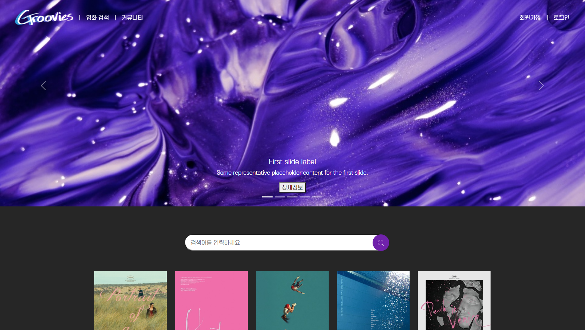
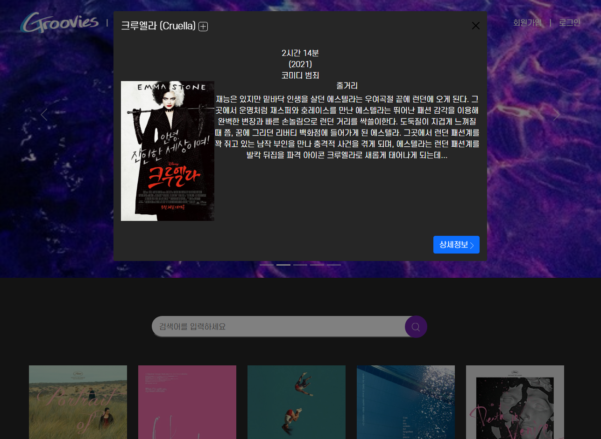
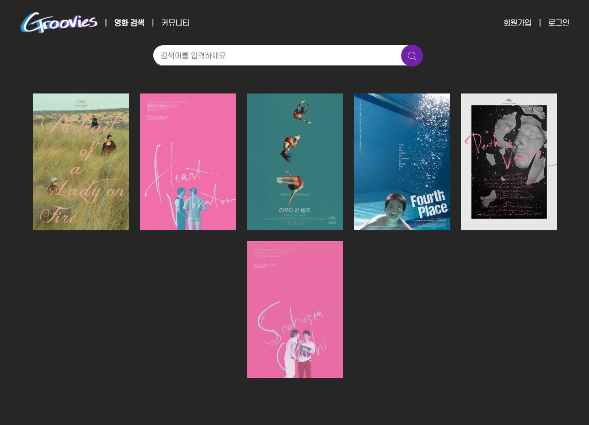
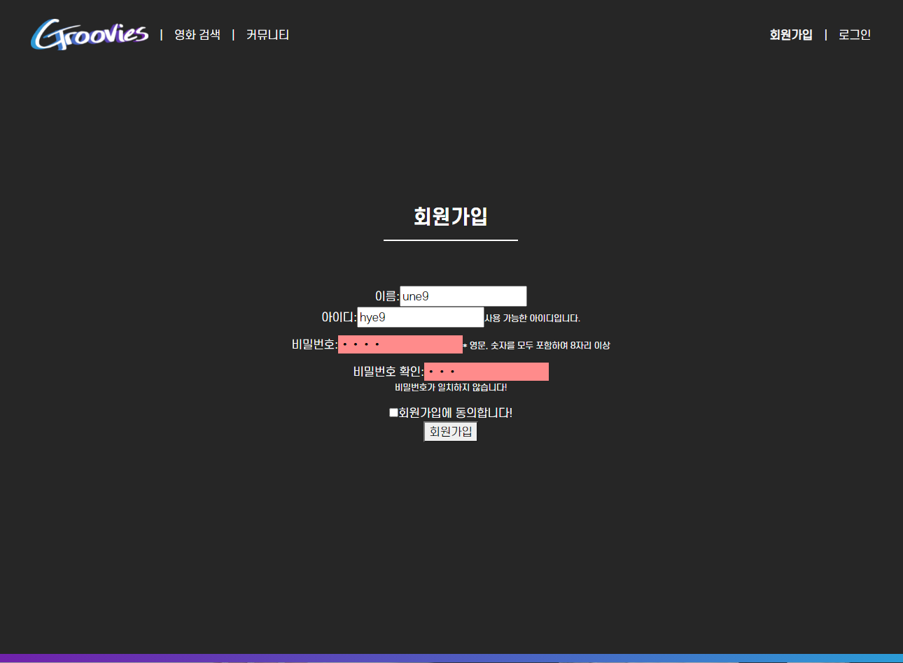

## FINAL PJT

3rd day (2021-11-19)

### 오늘 한 일

* 기본 기능 구현
  * 모달 데이터 보내주는 구조 짜고 보여주기
  * 회원가입, 로그인 input validation (통신 부분 제외 구현) 
  * 스타일 입히기 일부

 

### 회의내용

* 검색 필터 기능 구현하기 까다로울 것 같아서, 필수 구현사항이 아니라서 일단 보류하고 시간 남으면 하는 걸로..
* 결국 home 페이지에서 추천 영화 목록을 주제별로 나눠서 carousel에 담지 않고 그냥 뭉텅이로 보여주기로 바꿨다

 

#### 구현 중간과정 스크린샷

 

### 구현 중 공부한 내용

#### 알게된 것

* 일러스트레이터에서 css 속성 내보내기를 할 수 있다?! 짱좋다.. footer 그라디언트 색을 css 그라디언트 만들어주는 사이트에서 코드 만들어 왔더니 중간색이 이상하게 진해서 일러에서랑 느낌이 달랐었는데 똑같이 만들 수 있다!! 굿

 

#### 에러 & 헤맨 내용 (해결)

* ` Failed to resolve filter: convertToTime` : filters를 filter로 써서 났던 거...

* `Refused to display ... in a frame because it set 'X-Frame-Options' to 'sameorigin'.` : 분명히 youtube embed가 공식적으로 지원되는데 왜 막는거야!! 라고 화냈는데 사실 내가 url을 embed용 url이 아니라 퍼가기 용 url 형식으로 잘못 써서 나온 에러..

  https://developer.mozilla.org/en-US/docs/Web/HTTP/Headers/X-Frame-Options

  https://meaownworld.tistory.com/171

* 푸터를 평소에는 스크롤 맨 마지막에, body content 길이가 화면보다 짧을 경우 창 하단에 고정시키기

  https://stackoverflow.com/questions/34796085/how-to-stick-footer-to-bottom-not-fixed-even-with-scrolling/56272217

#### 헤매다가 아직 답 못찾음...ㅠㅠ

* `The service worker navigation preload request was cancelled before 'preloadResponse' settled. If you intend to use 'preloadResponse', use waitUntil() or respondWith() to wait for the promise to settle.`

  https://velog.io/@unu/%EC%84%9C%EB%B9%84%EC%8A%A4-%EC%9B%8C%EC%BB%A4%EC%97%90%EC%84%9C-%EB%B8%8C%EB%9D%BC%EC%9A%B0%EC%A0%80-%ED%9E%8C%ED%8A%B8-PreLoad-%EC%A7%80%EC%9B%90%EC%9D%84-%ED%99%9C%EC%84%B1%ED%99%94%ED%95%98%EC%97%AC-%ED%8E%98%EC%9D%B4%EC%A7%80-%EC%86%8D%EB%8F%84-%ED%96%A5%EC%83%81%EC%8B%9C%ED%82%A4%EB%8A%94-%EB%B2%95

  완전 똑같은 상황이신 분 발견.. 사실 이 처음 보는 에러가 왜 뜨는지도 몰랐는데

  > tmdb api에서 지원되는 비디오들의 유튜브 키를 변수로 받아서 로드 하는데 자꾸 아래와 같은 에러가 떠서 찾아봤다.

  ㅋㅋㅋ그렇구나.. 근데 한국어로 번역해준걸 읽어도 어떻게 해결하라는 건지 잘 모르겠다ㅠ

  https://developer.mozilla.org/ko/docs/Web/API/FetchEvent/respondWith

  ㅜㅜ 일단 보류..

* 영화 상세 정보는 포스터 클릭해서 모달이 나타나면서 가져와서 띄우고 싶었는데(데이터 양이 많아지면 첫 페이지 로딩이 느려질 것 같아서), 현재 구조상 렌더링이 home 화면 렌더링 될 때 모달까지 다 렌더링이 돼야 돼서 처음에 다 가져오는 걸로 일단 해뒀다. 일단은 로딩이 느리진 않은데 데이터 개수가 작아서 그런 것 같기도 해서 나중에 다시 봐야 될 것 같다. 

* 영화 모달에 버튼을 달아야 하는데 모달을 누르면 창이 꺼지도록 돼있어가지고ㅠ 방법을 찾아보는데 분명히 `data-backdrop="static"` 주면 안꺼진댔는데 계속 꺼진다.. 심지어 부트스트랩 홈페이지에서 static backdrop modal이라고 나와있는 아이템 그대로 갖다 써봤는데도 꺼진다,,, 왜지?!??!?!?ㅠㅠㅠ

  https://getbootstrap.com/docs/4.4/components/modal/#static-backdrop

* 모달 버튼 색깔 흰색으로 바꾸고 싶어서 구글링했는데 적용돼있는 클래스명(`.close`) 똑같이해서 덮어씌우면 된대서 해봤는데 일단 내꺼에 적용된 클래스들은 `.btn-close` 였고, 이렇게 저렇게 다 해봤는데 css 적용이 된걸로 나오는데도 색은 안바뀜... ("?????") ㅠㅠ

* 아이콘을 넣었는데 화질이 깨진다.. 확대해보면 깨끗하길래 원래 크기보다 너무 작게 넣어서 깨져보이는 것 같아서 원래 png로 넣었었는데 svg로 다시 넣어봤는데도 여전히 깨진다.. 왜 svg가 깨지지????ㅠㅠ
* 포스터 리스트도 전체적으로는 화면 가운데로 정렬이 되고 맨 마지막 줄 아이템들은 가운데로 정렬되는게 아니라 왼쪽으로 붙게 하고 싶은데 안돼서 보류ㅠ 아마도 wrapper width를 정해주고 전체 가운데 정렬을 따로 해줘야 될 것 같다. 

 

### 소감

ㅠㅠㅠ... 너무 힘들다..ㅋㅋ큐ㅠㅠㅠㅠ에러지옥... 살려줘ㅠㅠ

그래도 에러가 나타나서 하나하나 해결이 되면 좋은데 계속 보류하고 계속 넘겨도 해결이 안되고 결국 돌아서 다시 와도 막히니까 힘빠지는 것 같다 ㅠㅠㅠㅠ 아무리 생각해도 난 왜 부트스트랩이 더 어렵냐... 빠르고 편하게 쓰려고 하는건데 커스텀이 어려워서 예전에 모달 직접 만들었을 때랑 시간적 차이가 별로 안나는 것 같다,,,ㅠㅠ 내가 잘 못써서 그런가,,, bootstrap cdn으로 가져오지 말고 파일 다운로드해서 직접 고쳐가면서 쓰면 나을 것 같기도 하고,, 내일은 차라리 그렇게 해봐야겠다. 생각보다 더 할 일이 많은데 진도도 잘 안나가서 답답하다ㅠ

 

