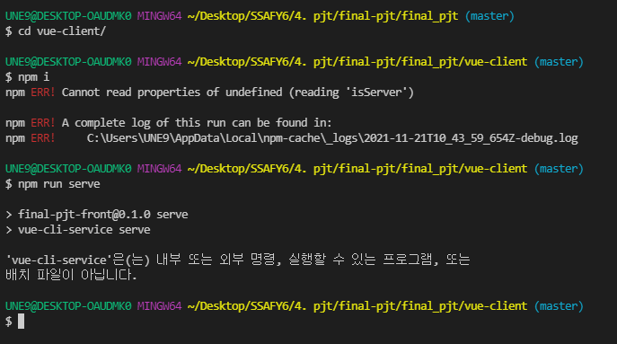
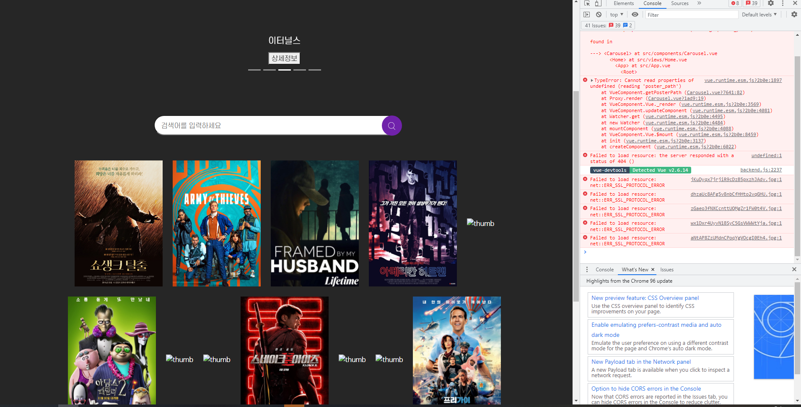
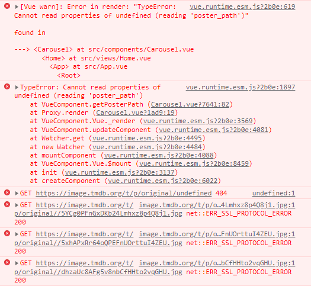

## FINAL PJT

fifth day (2021-11-21)

### 오늘 한 일

* search 로직 완성
* community 페이지 axios 제외 완성
  * TheCommunity.vue
  * TheCommunityArticle.vue
* django drf 서버랑 연결

<br>

### 에러 or 알게된 것

* 이미지 src를 변수로 설정하는 법: https://ordinary-code.tistory.com/85

* 서버가 새고되는 속도가 엄청 느려졌다.. 왜지? -> 아마 그냥 컴퓨터 문제인듯,, 잠시 끄고 쉬었다가 켜니까 잘됨

* ```
  $ npm run serve
  
  > final-pjt-front@0.1.0 serve
  > vue-cli-service serve
  
  'vue-cli-service'은(는) 내부 또는 외부 명령, 실행할 수 있는 프로그램, 또는
  배치 파일이 아닙니다.
  ```

  ```
  npm ERR! Cannot read properties of undefined (reading 'isServer')
  npm ERR! Cannot read properties of undefined (reading 'isServer')
  
  npm ERR! A complete log of this run can be found in:
  npm ERR!     C:\Users\UNE9\AppData\Local\npm-cache\_logs\2021-11-21T10_08_20_284Z-debug.log
  ```

  페어가 깃에 올린 버전으로 새로 클론 받아서 하려고 했는데 npm run serve하면 계속 저런 에러가 떠서 검색했는데 하라는 내용이 vue-cli 지웠다가 다시 깔기, npm cache 지웠다가 다시 npm install 하기 이런거 나와서 다 해봤는데도 계속 똑같다..ㅠㅠ

  <br>

* 

  

  이미지가 안뜨는 현상..

  -> 데이터가 로드되지 않았을 시점에 데이터가 없어서 에러가 떴다,, 

  carousel의 getPosterPath 함수를

  ```
  if (carouselItem) {
  	return `https://image.tmdb.org/t/p/original/${carouselItem.poster_path}`
  }
  ```

  이렇게 바꿔줬더니 빨간불들이 대부분 사라졌다

  ```
  GET https://image.tmdb.org/t/p/original/undefined 404   undefined:1
  ```

  이 빨간불이 하나 남아서 더 살펴봤는데 이것도 moviemodal에서 selectedMovie가 아직 없을 때 this.selectedMovie가 mapState객체여서 this.selectedMovie.poster_path 하니까 undefined가 뜨는 거였다! 그래서 이렇게 고쳐줬다.

  ```
  poster_path: function () {
          return this.selectedMovie.poster_path ? `https://image.tmdb.org/t/p/original/${this.selectedMovie.poster_path}`: ''
        }
  ```

  <br>

* 장고의 시크릿 키

  https://wayhome25.github.io/django/2017/07/11/django-settings-secret-key/

* 메인페이지에서 검색하면 서치 페이지 검색창에도 검색어가 보이도록 잘 만들어놨었는데,,, 백이랑 연결하면서 뭔가 틀어졌나보다,,,,, 오류난다 ㅠㅠㅠㅠ

<br>

### 고려사항

* vuex의 searchKeyword가 변경될 때(사용자가 검색을 했을 때) 새로운 검색 결과 리스트를 가져오는 함수를 computed가 아니라 watch로 구현 (검색 결과를 가져오는 비동기식이 수행되어야 하기 때문에)

  > 대부분의 경우 computed 속성이 더 적합하지만 사용자가 만든 감시자가 필요한 경우가 있습니다. 그래서 Vue는 `watch` 옵션을 통해 데이터 변경에 반응하는 보다 일반적인 방법을 제공합니다. 이는 데이터 변경에 대한 응답으로 비동기식 또는 시간이 많이 소요되는 조작을 수행하려는 경우에 가장 유용합니다.
  >
  > https://kr.vuejs.org/v2/guide/computed.html#watch-%EC%86%8D%EC%84%B1

<br>

### 소감

오늘 정말,,, 너무 힘들었다ㅠ 각종 에러가 계속 나오는데 해결도 안되고 원래 잘 됐던것도 안되고 ㅠㅜ... 엉엉 힘을 내야지..ㅠㅠㅠ

<br>

