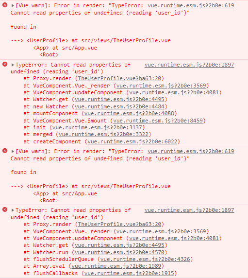
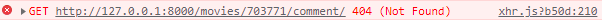

## FINAL PJT

9th day (2021-11-25)

### 오늘 한 일

* 전반적인 에러 찾기 & 수정
  * 에러지옥
* 스타일 입히기
  * 반응형 css

<br>

### 알게된 것 & 에러

* 

  아마 이번 프로젝트 하면서 가장 많이 본 종류의 에러가 아닐까.. data가 undefined나 null인 상태에서 property에 접근하려고 해서 생기는 에러,, 그런데 아직도 어떻게 해결해야 하는지는 조금 어렵다ㅠ

   -> 접근하기 전에 하나씩 콘솔로그 찍어보면서 데이터 구조를 확인했다. 마찬가지로 created에 원하는 함수를 넣어서는 해당 페이지에 접속할 때마다 trigger가 되지 않아서 App.vue의 $route watcher 안에서 확인을 하도록 했는데, watcher 안에서 vuex store 변수 접근이 안돼서 store에서 user_id를 전해주는 getters를 만들어준 다음에 getters에 접근해서 확인할 수 있었다! 

  ```
  // App.vue
  watch: {
        $route (to, from){
            if (to.name ==='Search' && from.name === 'Home') {
              this.$store.dispatch('onSearch', this.$route.params.keyword) 
            }
            if (to.name === 'UserProfile') {
              this.$store.dispatch('updateIsMySelf', this.$store.getters.loginUserId === this.$route.params.user_id)
            }
        }
      },
  ```

  ```
  // store/index.js
  getters: {
      loginUserId: state => {
        return state.loginUser.user_id
      }
    },
  ```

* 커뮤니티 글 작성 페이지를 버튼을 눌러서 들어가지 않고 리로드를 하는 등의 상황이 되면 데이터가 비어있는 article 조회 페이지가 나오는 현상이 있다. 아마 버튼 누르면 제대로 접근되는 이유는 버튼에는 click event를 걸어서 push로 name을 따라 찾아가는데, 그게 아니라 url path로 라우팅되면 주소가 꼬이는 것 같다고 추측했다.

  ```
  // router/index.js
  {
      path: '/community/create',
      name: 'CommunityArticleCreate',
      component: CommunityArticleCreate
    },
    {
      path: '/community/:article_id',
      name: 'CommunityArticle',
      component: CommunityArticle
    },
  ```

  원래 create가 밑에 있었는데 위로 올려줬더니 해결됐다. community/create 경로가 article_id에 먼저 걸려서 꼬였던 게 맞았다!! 

* 체크박스 체크하면 파랑색인데 그걸 테마색인 보라색으로 바꾸고 싶었는데,, 이게 생각보다 까다로운가보다,, 원하는 결과물에 비해 품이 많이 드는듯,, 결국 만들긴 만들었다ㅋㅋ 이 시시점에 이걸 굳이 왜 하고 있나 싶긴한데,,ㅠㅋㅋㅋ

  https://stackoverflow.com/questions/24322599/why-cannot-change-checkbox-color-whatever-i-do

  https://stackoverflow.com/questions/4148499/how-to-style-a-checkbox-using-css
  
* 

  상세 페이지를 로드할 때 댓글이 없는 경우 404가 뜬다. 원래 에러가 catch돼서 console.log로 찍힌 에러까지 두개였는데

  ```
  axios({
          method: 'get',
          url: `http://127.0.0.1:8000/movies/${this.movie_id}/comment/`
        })
        .then(res => {
          this.comments = res.data
        })
        .catch(err => {
          if (err.request.status === 404) {
            this.comments = []
          } else console.log(err)
        })  
  ```

  이렇게 처리를 해주고 나서도 저 에러 하나가 여전히 뜬다. -> 장고에서 아예 404가 뜨지 않고 빈 데이터를 보내도록 처리했다

* 

  하아..

  https://stackoverflow.com/questions/53545800/internal-modules-cjs-loader-js582-throw-err

  1. node modules 지우기 
  2.  package-lock 지우기
  3. npm install
  4. npm run serve

* git clone 받을때 폴더이름 한국어로 하면 에러남

* 페어가 업데이트해준 깃 레포 클론 받아서 돌려보는데 뷰 에러 나면 저 위에꺼대로 하면 서버는 켜진다. 그런데 예상치도 못하게 자꾸 로그인 관련된 기능들에서 401 unauthorized 에러가 떠가지고 ???? 하는데 또 됐다가 안됐다가 그래가지고 ?????????? 이러고 다시 처음부터 클론받아서 db 랑 migrations 날리고 다시 했다가 random 함수에서 에러나서 그제서야 아 db를 다 날리면 영화정보도 다 날라가는구나 ㅋㅋㅋㅋ 바보! 이러고 다시 클론받아서 accounts만 날렸다가 그래도 401 계속 나길래 또 헤매다가 내 다른 폴더에서 작업하던 탭을 열어놨던 게 문제였다는걸 발견했다 ㅋㅋㅋ 난 그쪽 서버 껐으니까 괜찮은줄 알았지...ㅠ 같은 크롬 브라우저여서 아마 두 탭의 정보가 동기화가 됐다가 안됐다가 그랬던 것 같다,, 바보였다.. 열려있는 뷰 탭 다 끄고 새로 서버 돌리니까 문제없이 잘돌아갔다 ㅠㅅㅠ 하아.... 정말 막막했는데 그래도 발견하고 나니까 어이없긴 하지만 에러지옥에서 탈출할 희망이 보여서 ~~넘나 행복하다...~~ 행복은 잠시였다...

* ㅠㅠㅠㅋㅋㅋㅋ하 끝까지 이 에러지옥 ㅠ

* 깃에서 받아서 새로 세팅하고 돌렸을 때 포스터 이미지가 안나오는 사건이 계속 있다ㅠ -> .env에 파일 루트가 없어서 그런 거였음.. 

<br>

### 소감

두명이서 열흘정도를 밤낮없이 이것만 했는데도 이 간단한 사이트 하나 만들기조차 쉽지 않구나..😥 간단해보여도 생각보다 고려할게 엄청 많고, 나름 처음에 기획을 탄탄하게 한다고 했는데도 만들면서 처음부터 기획을 잘 했어야하는 부분들이 많다는걸 알게됐다. 컴포넌트 재사용을 위한 구조 분리라든지.. 스타일도 클래스를 한번 잘 만들어놓으면 여기저기 클래스 적용만 하면 되니까 빠른데, 이름을 너무 지엽적으로 지었다든지.. 갖다 쓰긴 썼는데 우선순위 충돌이 나서 적용이 안된다든지, 로그인 정보는 모든 페이지에서 가져다 쓰니까 한 컴포넌트에 두는게 아니라 vuex에서 전역적으로 관리해야 훨씬 편하다든지 등등 하나의 컴포넌트를 만들더라도 전체적인 구조를 고려하면서 만들어야한다는 걸 느꼈다. 그걸 더럽지만 일단 되는대로 어떻게든 만들고 나중에 리팩토링하겠다는 생각은 생각보다 어렵다는거.. 그래도 계속 유지보수를 하려면 리팩토링을 언젠간 해야 하긴 하겠지만 처음 깔끔하게 만드는것보다도 오래걸리고 복잡하다. 

휴.. 에러지옥...ㅠㅠ그만...ㅠㅠㅠ 않이 외않되와 이게 왜 돼?의 환장의 콜라보...

<br>

